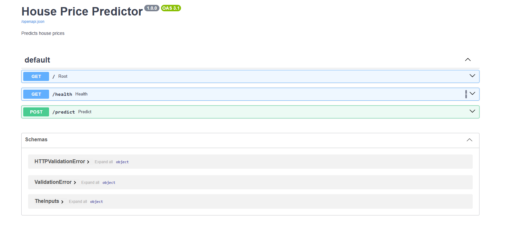

# House Price Predictor API

A machine learning REST API that predicts house prices based on property features from the Boston Housing dataset. The API is built with FastAPI and provides an interactive Swagger UI for testing predictions.

## Demo


## Tech Stack
- Python, FastAPI, Scikit-learn, Docker

## How it works
The API is trained on the Boston Housing dataset, which contains information about housing characteristics and their relationship to house prices. The problem is a regression task, where the model predicts a continuous house price based on the input features.

A scikit-learn regression model is trained on the dataset to learn the relationship between the housing features and their target prices. The trained model is then integrated into a FastAPI application, allowing users to send property information through a REST API and receive a predicted house price.

The application is containerized with Docker so it can be built and run consistently across different environments.

## API Endpoints
| Endpoint | Method | Description |
|----------|--------|-------------|
| / | GET | Health check |
| /health | GET | Status |
| /predict | POST | Returns prediction |

## Sample Request
```
curl -X 'POST' \
  'http://127.0.0.1:8000/predict' \
  -H 'accept: application/json' \
  -H 'Content-Type: application/json' \
  -d '{
  "crim": 0.00632,
  "zn": 18.0,
  "indus": 2.31,
  "chas": 0,
  "nox": 0.538,
  "rm": 6.575,
  "age": 65.2,
  "dis": 4.09,
  "rad": 1,
  "tax": 296.0,
  "ptratio": 15.3,
  "b": 396.9,
  "lstat": 4.98
}'
```

## Sample Response
```
{
  "Avg Price": 25.331999999999997,
  "details": {
    "crim": 0.00632,
    "zn": 18,
    "indus": 2.31,
    "chas": 0,
    "nox": 0.538,
    "rm": 6.575,
    "age": 65.2,
    "dis": 4.09,
    "rad": 1,
    "tax": 296,
    "ptratio": 15.3,
    "b": 396.9,
    "lstat": 4.98
  }
}
```

## Run Locally
1. Clone the repository
   git clone https://github.com/Sunnah25/house-price-api
   cd house-price-api
2. Build the Docker image
   docker build -t house-price-api .
3. Run the container
   docker run -p 8000:8000 house-price-api
4. Open the API documentation
   Visit: http://localhost:8000/docs
   You can also check the API status: curl http://localhost:8000/health

## Model Performance
- House Price: R² 0.62, MAE $3,040
